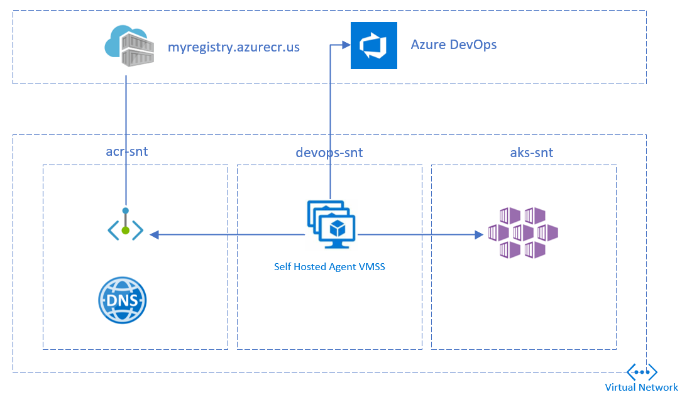

# Using Azure DevOps to deploy an application on AKS Private Cluster in Azure US Government

This article details building and deploying a container to Azure Government cloud using Azure DevOps.

The setup has 3 subnets with the following components

1. Azure Container Registry Private Endpoint
1. Azure DevOps self hosted agent
1. Azure Kubernetes Service



## Network setup

Create a [Virtual Network](https://docs.microsoft.com/en-us/azure/virtual-network/quick-create-portal#create-a-virtual-network) and add 3 subnets.

Use the below values for reference:

Address Space: 10.0.0.0/16

Subnet name | Address Space
------------|--------------
acr-snt | 10.0.1.0/24
devops-snt | 10.0.2.0/24
aks-snt | 10.0.4.0/22

```bash
az group create --name gov-devops --location usgovtexas

az network vnet create \
  --name gov-devops-vnet \
  --resource-group gov-devops \
  --subnet-name default
  
az network vnet subnet create \
  --address-prefixes 10.0.1.0/24\
  --name acr-snt \
  --resource-group gov-devops \
  --vnet-name gov-devops-vnet
  
az network vnet subnet create \
  --address-prefixes 10.0.2.0/24\
  --name devops-snt \
  --resource-group gov-devops \
  --vnet-name gov-devops-vnet
  
az network vnet subnet create \
  --address-prefixes 10.0.4.0/22\
  --name aks-snt \
  --resource-group gov-devops \
  --vnet-name gov-devops-vnet
```

## Create ACR

[Create](https://docs.microsoft.com/en-us/azure/container-registry/container-registry-get-started-azure-cli) a Container Registry in the premium tier (required for private link)

```bash
az acr create --resource-group gov-devops \
  --name mygovacr --sku Premium
```

[Create](https://docs.microsoft.com/en-us/azure/container-registry/container-registry-private-link#set-up-private-link---cli) the registry’s private endpoint in the acr-snt subnet 

```bash
az network vnet subnet update \
 --name acr-snt \
 --vnet-name gov-devops-vnet \
 --resource-group gov-devops \
 --disable-private-endpoint-network-policies
 
az network private-dns zone create \
  --resource-group gov-devops \
  --name "privatelink.azurecr.io"
  
az network private-dns link vnet create \
  --resource-group gov-devops \
  --zone-name "privatelink.azurecr.io" \
  --name govdns \
  --virtual-network gov-devops-vnet \
  --registration-enabled false
  
REGISTRY_ID=$(az acr show --name mygovacr \
  --query 'id' --output tsv)

az network private-endpoint create \
    --name myPrivateEndpoint \
    --resource-group gov-devops \
    --vnet-name gov-devops-vnet \
    --subnet acr-snt \
    --private-connection-resource-id $REGISTRY_ID \
    --group-id registry \
    --connection-name myConnection

NETWORK_INTERFACE_ID=$(az network private-endpoint show \
  --name myPrivateEndpoint \
  --resource-group gov-devops \
  --query 'networkInterfaces[0].id' \
  --output tsv)
  
PRIVATE_IP=$(az resource show \
  --ids $NETWORK_INTERFACE_ID \
  --api-version 2019-04-01 \
  --query 'properties.ipConfigurations[1].properties.privateIPAddress' \
  --output tsv)

DATA_ENDPOINT_PRIVATE_IP=$(az resource show \
  --ids $NETWORK_INTERFACE_ID \
  --api-version 2019-04-01 \
  --query 'properties.ipConfigurations[0].properties.privateIPAddress' \
  --output tsv)
  
az network private-dns record-set a create \
  --name mygovacr \
  --zone-name privatelink.azurecr.io \
  --resource-group gov-devops

# Specify registry region in data endpoint name
az network private-dns record-set a create \
  --name mygovacr.usgovtexas.data \
  --zone-name privatelink.azurecr.io \
  --resource-group gov-devops
  
az network private-dns record-set a add-record \
  --record-set-name mygovacr \
  --zone-name privatelink.azurecr.io \
  --resource-group gov-devops \
  --ipv4-address $PRIVATE_IP

# Specify registry region in data endpoint name
az network private-dns record-set a add-record \
  --record-set-name mygovacr.usgovtexas.data \
  --zone-name privatelink.azurecr.io \
  --resource-group gov-devops \
  --ipv4-address $DATA_ENDPOINT_PRIVATE_IP
  
az acr update --name mygovacr --public-network-enabled false
```

Choose one of the below authentication methods to perform docker login from the DevOps pipelines
 - [Admin Account](https://docs.microsoft.com/en-us/azure/container-registry/container-registry-authentication#admin-account) 
 - [Service Prinicpal](https://docs.microsoft.com/en-us/azure/container-registry/container-registry-auth-service-principal)

```bash
az acr update -n mygovacr --admin-enabled true
```

Note the admin username and password from the ACR *Access Keys* blade in the portal

## Create AKS

[Create](https://docs.microsoft.com/en-us/azure/aks/private-clusters) a private AKS cluster in the aks-snt subnet

Integrate ACR with AKS or create a pull secret

```bash
kubectl create secret docker-registry regcred --docker-server=<your-registry-server> --docker-username=<your-name> --docker-password=<your-pword> --docker-email=<your-email>
```

## Create a VM and deploy DevOps agent

[Create](https://docs.microsoft.com/en-us/azure/virtual-machines/linux/quick-create-portal#create-virtual-machine) a Linux VM in devops-snt subnet to host the DevOps agent.

```bash
az vm create \
  --resource-group gov-devops \
  --name devopsagent \
  --image UbuntuLTS \
  --admin-username azureuser \
  --generate-ssh-keys \
  --subnet devops-snt \
  --vnet-name gov-devops-vnet
```

Note the publicIpAddress from the output

[Deploy](https://docs.microsoft.com/en-us/azure/devops/pipelines/agents/v2-linux?view=azure-devops) the DevOps agent on the VM

- Generate a PAT token
- Create an Agent Pool
    - Click *Add Pool*
    - Select *New*
    - Select pool Type as *Self-hosted*
    - Enter a name as *govpool*
    - Select New Agent -> Linux
- Copy the Agent Download link
- Deploy the agent on the VM

```bash
ssh azureuser@publicIpAddress

curl -O <<url copied above>
mkdir myagent && cd myagent
tar zxvf ../{tar file name}

./config.sh
sudo ./svc.sh install
sudo ./svc.sh start
```

Install docker, az cli and kubectl

```bash
sudo apt -y update
sudo apt -y install apt-transport-https ca-certificates curl gnupg-agent software-properties-common
curl -fsSL https://download.docker.com/linux/ubuntu/gpg | sudo apt-key add -
sudo add-apt-repository "deb [arch=amd64] https://download.docker.com/linux/ubuntu $(lsb_release -cs) stable"
sudo apt update
sudo apt install docker-ce docker-ce-cli containerd.io
sudo usermod -aG docker $USER
newgrp docker

curl -sL https://aka.ms/InstallAzureCLIDeb | sudo bash
sudo az aks install-cli

```

## Create the pipeline

### Create Service Connections

From Azure DevOps, create a Docker Registry Service Connection
- Navigate to *Project Settings*
- Click *New Service Connection*
- Select *Docker Registry*
- Select Registry Type as *Others*
- Provide the below details:
    - Docker Registry: *{ ACR url eg: https://mygovacr.azurecr.us }*
    - Docker ID: *{ admin username or Service principal App ID }*
    - Docker Password: *{ admin password or service principal secret }*
    - Service Connection name: *{ Connection name }*

To run kubectl task against the AKS cluster, [Create](https://docs.microsoft.com/en-us/azure/active-directory/develop/howto-create-service-principal-portal) Service Principal and grant contributor access to the resource group


From Azure DevOps, create an Azure Resource Manager Service Connection 
- Navigate to *Project Settings*
- Click *New Service Connection*
- Select *Azure Resource Manager*
- Select *Service Principal (manual)*
- Provide the below details:
    - Environment: *Azure US Government*
    - Subscription Id: *{ Gov Subscription ID }*
    - Subscription Name: *{ Gov Subscription Name }*
    - Service Principal Id: *{ Create Service Principal using Portal or PowerShell }*
    - Credential: Service Principal key: *{ Secret of the Service Principal }*
    - Tenant Id: *{ Gov Tenant ID }*
    - Service Connection name: *{ Connection name }*

### Create pipeline

- Fork the [sample repo](https://github.com/seenu433/nginx-echo-headers) 
- Copy the contents below to a deploy.yaml file in the repo (Remove imagePullSecrets if ACR integrated with AKS)

```yml
apiVersion: v1
kind: Pod
metadata:
  name: private-reg
spec:
  containers:
  - name: private-reg-container
    image: mygovacr.azurecr.us/nginx-echo-headers:latest
  imagePullSecrets:
  - name: regcred
```

- Navigate to the project in Azure DevOps
- Go to Pipelines, and then select New Pipeline
- Select GitHub as the location of your source code and select your repository
- Select Starter pipeline
- Replace the contents of the yaml in the Review tab

```yml
trigger:
- master

pool:
  name: 'govpool'

steps:
- task: Docker@2
  inputs:
    containerRegistry: '{Docker Registry Service Connection Name}'
    repository: 'nginx-echo-headers'
    command: 'buildAndPush'
    Dockerfile: 'Dockerfile'
    tags: 'latest'
- task: Kubernetes@1
  inputs:
    connectionType: 'Azure Resource Manager'
    azureSubscriptionEndpoint: '{Azure Resource Manager Service Connection Name}'
    azureResourceGroup: 'gov-devops'
    kubernetesCluster: '{aks cluster name}'
    command: 'apply'
    arguments: '-f deploy.yaml'
```

